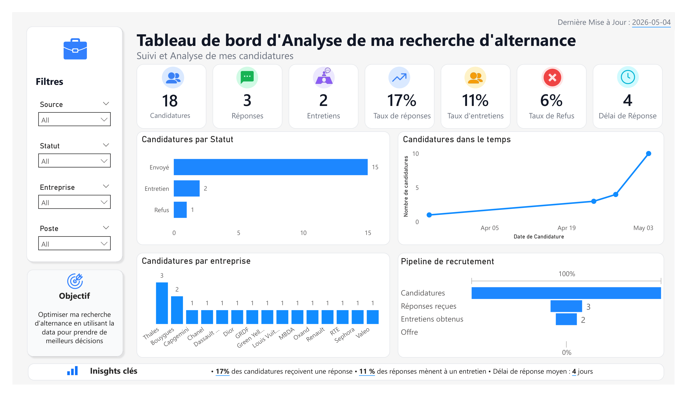

# Job Search Analytics — Suivi de recherche d'alternance


Projet de suivi et d'analyse de ma recherche d'alternance en Data Science.

---

## Objectif

Transformer mon suivi de candidatures en un outil analytique pour identifier les patterns de réponse, mesurer l'efficacité de ma recherche et prendre de meilleures décisions.

---

## Dashboard Power BI

Le dashboard suit en temps réel :

- Nombre de candidatures envoyées
- Taux de réponse et taux d'entretien
- Temps moyen de réponse par entreprise
- Pipeline de recrutement (candidature → entretien → offre → refus)
- Analyse par secteur, localisation et type de poste


---

## Architecture

```text
Excel (source de données)
        │
        ▼
Power BI (transformation + dashboard)
        │
        ▼
Analyse & décisions
```

---

## Stack

| Catégorie | Outil |
|---|---|
| Collecte | Excel |
| Visualisation | Power BI |
| Scripting | Python (pandas) |

---

## Prochaine étape

Développement d'un modèle prédictif pour estimer la probabilité de réponse d'une candidature en fonction du secteur, du poste, de la taille de l'entreprise et du canal de candidature.

---

## Structure du repo

```text
job-search-analytics/
├── data/       # Dataset des candidatures
├── powerbi/    # Fichier .pbix
└── README.md
```
